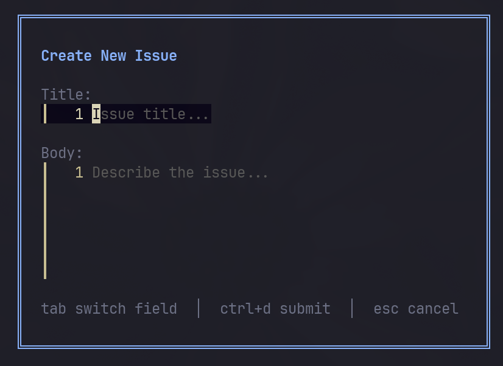
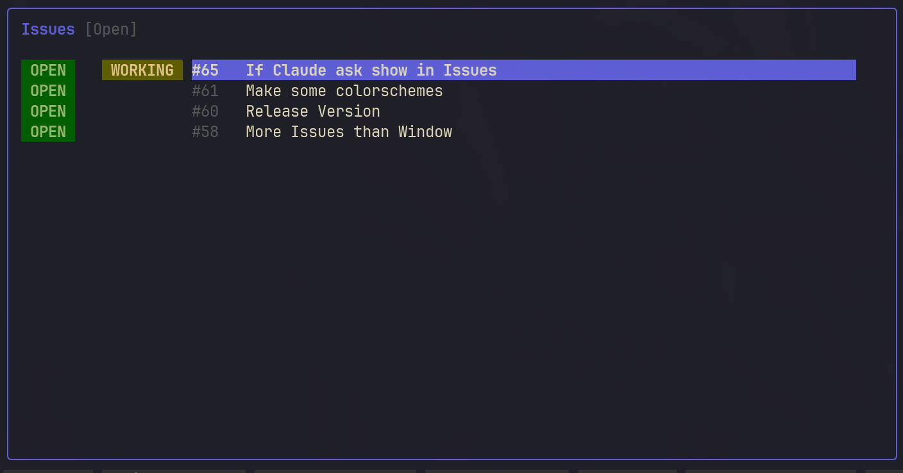
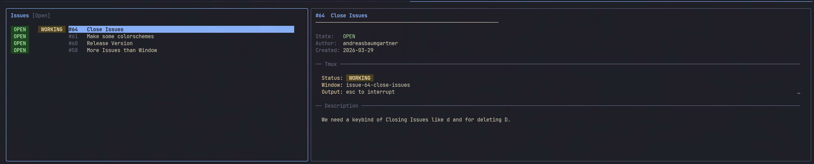

# gilo

A Terminal User Interface (TUI) for managing GitHub issues and AI agents, written in Go. Browse, create, and manage issues, spin up git worktrees, and launch Claude AI sessions — all without leaving your terminal.


## Screenshots

### Create New Issue


### Issues List


### Issue Detail View


## Features

### Issue Management
- Browse GitHub issues in a dual-panel TUI (list + detail view)
- Filter issues by state: **Open**, **Closed**, or **All**
- View issue details including body, labels, author, and comments
- Create new issues directly from the terminal
- Post comments on existing issues
- Add and remove labels with an interactive label picker
- Open issues in the browser

### Git Worktree Integration
- Automatically create git worktrees for issues with branch naming: `issue-{number}-{slugified-title}`
- Open worktrees in a new tmux window or as a split pane
- Worktrees are stored in a `.worktrees/` directory alongside your repository

### Claude AI Integration
- Launch Claude AI sessions with full issue context (number, title, body)
- Start Claude in a new tmux window or as a split pane
- Reuses existing Claude sessions if already running for an issue

### Tmux Status Tracking
- Live tmux window monitoring with a polling indicator
- See which issues have active tmux sessions with status badges:
  - **WORKING** — Claude is actively processing
  - **QUESTION** — Claude is waiting for user input
  - **REVIEW** — Claude has finished and exited
- View the last output line from active tmux panes

## Prerequisites

- **Go** 1.25.0 or later
- **[GitHub CLI (`gh`)](https://cli.github.com/)** — installed and authenticated (`gh auth login`)
- **[tmux](https://github.com/tmux/tmux)** — required for worktree and Claude features
- **Git**

## Installation

### Install with `go install`

The easiest way to install gilo on Linux (or any platform with Go):

```bash
go install github.com/andreasbaumgartner/gilo/cmd/gilo@latest
```

This downloads, compiles, and installs the `gilo` binary to your `$GOPATH/bin` (or `$GOBIN`). Make sure this directory is in your `PATH`:

```bash
export PATH="$PATH:$(go env GOPATH)/bin"
```

You can add the line above to your `~/.bashrc` or `~/.zshrc` to make it permanent.

### Build from source

```bash
git clone https://github.com/andreasbaumgartner/gilo.git
cd gilo
go build -o gilo ./cmd/gilo/
```

Optionally move the binary to a directory in your `PATH`:

```bash
sudo mv gilo /usr/local/bin/
```

### Run

Navigate to any Git repository with GitHub issues and run:

```bash
gilo
```

## Usage

Launch `gilo` from any GitHub repository directory. The application opens in fullscreen with two panels: the issues list on the left and issue details on the right.

### Keyboard Shortcuts

| Key | Action |
|-----|--------|
| `j` / `k` or `Up` / `Down` | Navigate issues |
| `Tab` | Switch focus between list and detail panels |
| `f` | Cycle filter: Open &rarr; Closed &rarr; All |
| `o` or `Enter` | Open issue in browser |
| `c` | Post a comment on the selected issue |
| `n` | Create a new issue |
| `l` | Manage labels on the selected issue |
| `w` | Create worktree and open in new tmux window |
| `W` | Create worktree and open in tmux split pane |
| `s` | Start Claude AI session in new tmux window |
| `S` | Start Claude AI session in tmux split pane |
| `q` | Quit |

### Modal Controls

| Key | Action |
|-----|--------|
| `Tab` | Switch between fields (title/body) |
| `Ctrl+D` | Submit (comment, issue, or label changes) |
| `Esc` | Cancel and close modal |

### Label Picker

| Key | Action |
|-----|--------|
| `j` / `k` | Navigate labels |
| `Space` | Toggle label on/off |
| `Ctrl+D` | Apply label changes |
| `Esc` | Cancel |

## How It Works

### Dual-Panel Layout

```
+-------------------------+----------------------------------+
|      Issues List        |       Issue Detail               |
|  [Filter: Open]         |  #42 Fix login flow              |
|                         |  -------------------------------- |
| [OPEN] [WORKING]  #42 Fix login  |  State: OPEN                |
| [OPEN] [QUESTION] #43 Add tests  |  Author: user               |
| [CLOSED]          #41 Update CI  |  Created: 2025-01-15        |
|                         |  Labels: bug, enhancement        |
|                         |                                  |
|                         |  -- Description --               |
|                         |  The login flow breaks when...   |
|                         |                                  |
|                         |  -- Comments (2) --              |
|                         |  user1 - 2025-01-16             |
|                         |    Looking into this now...      |
+-------------------------+----------------------------------+
 j/k nav | tab panel | f filter | o open | c comment | q quit
```

### Worktree Workflow

When you press `w` or `W` on an issue, gilo will:

1. Determine the repository root
2. Create a git worktree at `../.worktrees/issue-{number}-{slug}/`
3. Open the worktree directory in a new tmux window or split pane
4. Automatically prune stale worktree references

### Claude AI Workflow

When you press `s` or `S` on an issue, gilo will:

1. Create a worktree for the issue (if one doesn't exist)
2. Launch Claude CLI with the issue context as a prompt
3. Claude receives the issue number, title, and full body text
4. If a Claude session is already running for this issue, it reuses the existing session

## Project Structure

```
gilo/
  cmd/
    gilo/
      main.go                  # Application entry point
  internal/
    github/
      github.go                # GitHub CLI wrapper (issues, labels, comments)
    settings/
      settings.go              # User settings (load/save)
    tmux/
      tmux.go                  # Tmux session and pane management
    tui/
      model.go                 # TUI model, types, messages, initialization
      update.go                # Keyboard and event handling
      view.go                  # UI rendering (panels, modals, status bar)
      styles.go                # Lipgloss styles and colors
      commands.go              # Bubbletea commands (async operations)
      helpers.go               # Layout and string utilities
    worktree/
      worktree.go              # Git worktree management
  go.mod                       # Go module definition
  go.sum                       # Dependency checksums
  .gitignore                   # Git ignore rules
  README.md                    # This file
```

## Contributing

Contributions are welcome! Please open an issue or submit a pull request.

1. Fork the repository
2. Create your feature branch (`git checkout -b feature/my-feature`)
3. Commit your changes
4. Push to the branch (`git push origin feature/my-feature`)
5. Open a pull request

## License

This project is open source. See the repository for license details.
